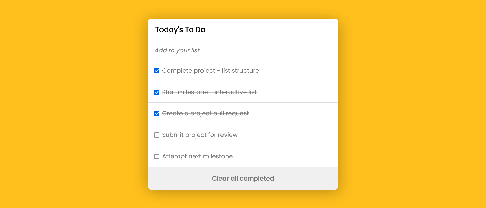

# To-do-list

> Reusing the TO DO List repository code to request a code review from our coding partners.

## Built With

- HTML
- CSS3
- javaScript
- Webpack

## Live Demo

[Live Demo Link](https://cathella.github.io/to-do-list/dist)

## Authors

👤 **Author**

- GitHub: [@Cathella](https://github.com/Cathella)
- Twitter: [@cathella9](https://twitter.com/cathella9)
- LinkedIn: [Nakitto Catherine](https://linkedin.com/in/nakitto-catherine-2020)

## 🤝 Contributing

Contributions, issues, and feature requests are welcome!

Feel free to check the [issues page](https://github.com/Cathella/todo-app/issues).

## Show your support

Give a ⭐️ if you like this project!

## 📝 License

This project is [MIT](./MIT.md) licensed.
